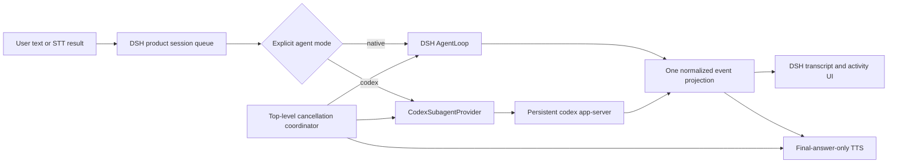

# DSH 与 Codex App Server 边界设计

状态：协议、Host durable seam 与 credential-isolated read-only turn 已实现
审计日期：2026-08-22
决策：实现顶层直连的 `CodexSubagentProvider`，不实现 `CodexLLMProvider`

> 当前实现状态（2026-08-17）：`packages/host/codex` overlay、typed Remote、
> pre-AgentLoop maintenance、durable `codex/*` event、strict thread map、0.149 stable
> generated runtime validator、ChatGPT auth/login 与权威 terminal/release 协议均已落地。
> 浏览器直连 Codex 控制面已被移除。真实探针证明 stable `read-only` sandbox 可读取
> HOME，因此 backend 改为双 App Server：auth-only 进程持有 managed login/refresh，
> execution 进程使用 credential-free HOME，并通过 private stdio 接受外部 access token。
> 实机订阅 turn 与无 token 落盘探针已通过。ApprovalGateway/workspace-write 仍未开放。

## 1. 结论

V1 的“Agent = Codex”是产品层的显式执行模式，不是 DSH 原生 agent 可以调用的
一个 tool，也不是把 Codex 伪装成 DSH 的 LLM provider。一次用户 turn 只能有一个
agent loop：

- `native` 模式由 DSH `AgentLoop` 独占执行；
- `codex` 模式在进入 DSH `AgentLoop`、LLM adapter 和 tool dispatch 之前，由顶层
  dispatcher 直接交给 `CodexSubagentProvider`；Codex App Server 独占该 turn 的
  agent loop；
- DSH 仍拥有产品 session、输入队列、模式、语音/UI 投影和顶层取消协调；Codex
  拥有 coding turn、工具执行、审批请求和 Codex thread 历史；
- 同一 DSH session 在任何时刻最多有一个 execution owner。切换模式必须先取消并
  等待当前 owner 到达 terminal/quiescent，再启动另一方。

名称中的 “Subagent” 表示 Codex 是 DSH 产品运行时委托和监管的独立 agent
backend；它不表示“先让 DSH native agent 思考，再由模型决定调用 Codex”。后者会
形成 agent-inside-agent，并被本设计禁止。



## 2. 固定审计基线

这两个 commit 属于不同仓库，不能混成同一个 pin：

| 基线 | 固定值 | 用途 |
| --- | --- | --- |
| 当前 voice 产品仓库 | `ecd45d66579b379f25a49e1da1c6d90c1ddaf91e` | 本方案开始时的产品/upstream voice 基线 |
| DeepSeek Harness `main` | `47f943859bef60e4160492346772ded9b24f765a` | DSH 协议、agent、session 和现有 Codex provider 的独立依赖基线 |
| DSH `subagent-codex` 开发依赖 | `@openai/codex 0.147.0` | upstream one-shot provider 的测试/实现基线 |
| 本机 Codex CLI | `codex-cli 0.149.0-alpha.4.1` | 本次 App Server schema 和实机握手基线 |
| 本机 Codex 可执行文件 | ChatGPT.app 内置 `codex` | V1 首选启动来源；实现不能把这个绝对路径硬编码进协议层 |

DSH 的审计链接全部固定到
[`47f9438`](https://github.com/deepseek-ai/deepseek-harness/tree/47f943859bef60e4160492346772ded9b24f765a)。
Codex 的产品协议依据是 OpenAI 官方
[App Server 文档](https://developers.openai.com/codex/app-server)和
[身份验证文档](https://developers.openai.com/codex/auth)。App Server 是版本化协议；
官方文档不能替代本机二进制生成的 schema，二者不一致时必须停在兼容性门禁，不能
猜测字段。

## 3. DSH upstream API 审计

### 3.1 One-shot subagent contract

[`SubagentProvider`](https://github.com/deepseek-ai/deepseek-harness/blob/47f943859bef60e4160492346772ded9b24f765a/packages/subagent/subagent/src/types.ts)
当前契约是 `start(request): Promise<SubagentRun>`：

- `start()` fulfillment 是 publication/ownership 边界。fulfillment 之前，provider
  清理未发布的局部资源；之后，调用方拥有 `run.result` 和幂等 `dispose()`；
- `request.signal` 是启动前和发布后的 canonical cancellation channel；
- child/model/transport 失败只要能表达为 `SubagentStopReason`，`run.result` 应 resolve
  而不是 reject；不可表达的 seam/infrastructure fault 才 reject；
- `dispose()` 必须达到 child quiescence，并释放整个运行资源；
- one-shot 支持的 start capabilities 只有 `outputSchema`、`depthLimit`、`toolFilter`、
  `persona`；provider 必须显式声明，不得静默降级；
- provider 可并发服务不同 child，但每个 child 的取消、settlement 和 teardown 必须
  相互隔离。

这个契约适合作为 ownership、abort 和 process teardown 的参考，但只返回最终
`SubagentResult`，不足以表达本产品所需的持久 thread、流式 UI/TTS、交互式审批、
steer 和跨 turn resume。因此 V1 不应把产品顶层 direct delegation 硬塞进当前
one-shot `SubagentProvider.start()`。

### 3.2 Continuable subagent contract

[`prepareContinuable`](https://github.com/deepseek-ai/deepseek-harness/blob/47f943859bef60e4160492346772ded9b24f765a/packages/subagent/subagent/src/types.ts)
不是远程 agent 的通用 continuation hook。它只允许 provider 在首次创建时提供一个
可选的 parent history seed；随后 DSH continuation manager 自己持有本地 `Agent`、
session identity、prompt inbox、cold resume 和 disposal。

[`SubagentRuntime`](https://github.com/deepseek-ai/deepseek-harness/blob/47f943859bef60e4160492346772ded9b24f765a/packages/subagent/subagent/src/index.ts)
公开 `startContinuable`、`followup`、`interrupt`、children/descendants 查询；这些 API
管理的是 DSH session-backed in-process child。现有 Codex provider 没有
`prepareContinuable`，所以不能借它获得 Codex thread continuation。

结论：Codex 的 continuation 必须由新的 DSH-session-to-Codex-thread 映射和 App
Server `thread/resume` 实现，不能声称复用了 DSH continuable manager。

### 3.3 Session queue、steer 与 cancel

DSH 原生 agent 的 inbox 在
[`core/agent/src/inbox.ts`](https://github.com/deepseek-ai/deepseek-harness/blob/47f943859bef60e4160492346772ded9b24f765a/packages/core/agent/src/inbox.ts)
中持久化为两条列表：

| 操作 | DSH 内部语义 | 对 direct Codex mode 的结论 |
| --- | --- | --- |
| `session.prompt(..., 'queue')` | `Agent.followup`，进入 `next-turn`；每个 turn FIFO claim 一条 | 产品层必须保留同等 FIFO 体验，但不得把 Codex-mode 队列放进会唤醒 native agent 的 inbox |
| `session.prompt(..., 'steer')` | `Agent.steer`，进入 `next-step`；只在后续 step boundary 被 claim | steer 不会中止当前 model call，不能承担语音 barge-in 的即时取消 |
| `Agent.cancel(cause)` | abort 当前 active turn；默认同时清空 `next-step` 与 `next-turn` | 产品 UI 的普通“停止全部”可以清队列，但必须是显式产品政策 |
| `Agent.cancel(cause, {keepInbox:true})` | abort active turn，保留两个 inbox | host 的 session cancel 和 continuable interrupt 采用这个语义；适合“打断当前、保留稍后输入” |

host `session.cancel()` 路径会调用 `agent.cancel({kind:'user'},
{keepInbox:true})`；pending queue 在取消后仍按 FIFO 执行。continuable subagent 的
`interrupt` 也是 fire-and-return，保留 queue/activation/descendants。UI 的
best-effort composer steer 在窗口关闭时可以退化为 next turn；针对某个严格 queue
row 的修改则可能返回 `steer-unavailable` 或 `queue-item-not-found`。

因此顶层路由需要自己的单一 session queue：native 模式由 adapter 安全投递到 DSH
inbox；Codex 模式由 direct dispatcher 在上一个 Codex terminal 后取下一条。不能
同时在产品 queue 和 Codex/DSH 内部再排同一条输入，否则取消和重试会重复执行。

## 4. upstream `subagent-codex` 审计

现有实现在
[`packages/subagent/subagent-codex`](https://github.com/deepseek-ai/deepseek-harness/tree/47f943859bef60e4160492346772ded9b24f765a/packages/subagent/subagent-codex)：

1. 每次 `start()` 新建一个 `codex app-server --stdio` 进程；
2. 执行 `initialize` → `initialized` → `thread/start`，且强制
   `ephemeral: true`；
3. 启动一个 text-only turn；不继承 parent context，不声明额外 start
   capability；
4. 只在 `item/completed` 收集最新 `phase: final_answer`，兼容回退到
   `phase: null`；忽略 commentary，不输出 delta/tool progress；
5. 命令和文件审批在无人值守下优先 `cancel`，否则 `decline`；permission 返回空
   grants，user input 返回空 answers，MCP elicitation decline；未知 server request
   fail closed；
6. abort 时 best-effort 发 `turn/interrupt`，本地 settlement 和 process-tree
   teardown 才是最终保障；
7. `contextWindowExceeded` 映射为 `max-tokens`，其余异常映射为 error；
8. result/dispose 后关闭 JSONL wire、stdin 和整个受管进程树。

### 4.1 可以复用的模式

- 固定 argv 启动 App Server，通过 DSH shared subprocess seam 获得 credential
  scrub、PID/tree ownership、分级 terminate 和 wait-for-exit；
- JSONL framing、request id correlation、响应/通知/双向 server request 分流；
- 单连接只能 initialize 一次的 handshake；
- `turn/start` response 与更早到达的 `turn/started`/`item/*` 通知之间的 race
  buffering；
- 对每个 notification/request 校验精确 `threadId` 和 `turnId`；
- known request 最小权限响应、unknown request fail closed；
- `final_answer` 优先、legacy nullable phase 兜底；
- abort、wire close、stdin EOF、process-tree teardown 的幂等 ownership。

### 4.2 不能直接复用的产品行为

| upstream 0.147 one-shot | V1 direct delegation |
| --- | --- |
| DSH native agent 通过 model-facing tool 发起 | 顶层 dispatcher 在 native loop 之前发起 |
| 每 turn 一个进程 | 每 host/profile 一个受管长驻 App Server，多个 thread 复用连接 |
| `ephemeral: true` | `ephemeral: false`，持久映射并可 `thread/resume` |
| 每次新 thread | 一个 DSH session 稳定映射一个 Codex thread；workspace 变更则显式换 thread |
| one-shot `result` | `started/delta/tool/approval/finished` 流 + terminal result |
| 最终答案一次性返回 | UI 流式投影；只把确定的 final-answer 内容交给 TTS |
| approvals 全部无人值守拒绝 | 已知请求由 DSH UI 交互处理；超时/关闭/未知请求 fail closed |
| 无 steer/follow-up API | 精确 `expectedTurnId` 的 same-turn steer；后续 turn 由产品 queue 串行 |
| 无版本/auth/product gate | 启动时检查 CLI/schema/ChatGPT account mode |
| 远程 run id 与产品 session 无持久关联 | durable DSH session → Codex thread map，active execution 另有短期 id |

现有 package 是协议和进程模式的基线，不是 V1 可直接注册后启用的完整功能。

## 5. 本机 Codex 0.149.0-alpha.4.1 审计证据

### 5.1 版本、schema 和 auth

本次使用 ChatGPT.app 内置二进制进行只读探测。没有读取配置文件、token、cookie、
email、account id 或任何 credential 内容。

| 项目 | 安全结果 |
| --- | --- |
| `codex --version` | `codex-cli 0.149.0-alpha.4.1` |
| `codex login status` | `Logged in using ChatGPT` |
| App Server `account/read {refreshToken:false}` | account kind 为 `chatgpt`；plan 字段存在；`requiresOpenaiAuth` 为 true；未记录字段值或身份信息 |
| stable schema 文件数 | 291 |
| experimental schema 文件数 | 363 |
| stable v2 bundle SHA-256 | `9b3de71a5a2ffc980b792a18aa8f8dec3f85f48829560222a0264fe494b679a9` |
| experimental v2 bundle SHA-256 | `a0d6da21a99d629299982c5a63971bb3fd1e242e26503e07d819505436250727` |

用于升级 semantic diff 的四个 stable envelope hash 是：

| 文件 | SHA-256 |
| --- | --- |
| `ClientRequest.json` | `bc1cf6f254356e7394e39e459e55a489b884760850aae22a78de3243fb855053` |
| `ServerRequest.json` | `e5ae9078cddac333262ae392fe25558d6054b77e4beb00784b77cf606849d063` |
| `ClientNotification.json` | `706cf248d75027c84a3c63348d0ed507182e8eba40069dd17541793de029145a` |
| `ServerNotification.json` | `ba1891fc66bdba34758eba92e22ce8770326d98111cb6088b4e6dc9e128795d3` |

可重复生成命令是：

```bash
codex app-server generate-json-schema --out /tmp/codex-schema/stable
codex app-server generate-json-schema --experimental --out /tmp/codex-schema/experimental
```

V1 只编译和运行 stable surface，并在 `initialize.capabilities` 设置
`experimentalApi:false`、`requestAttestation:false`。experimental 输出只用于升级
diff，不作为运行时 fallback。

### 5.2 initialize 与连接生命周期

本机实测：

- `initialize` 需要 `clientInfo`；capabilities 可声明 `experimentalApi`、
  `requestAttestation`、要抑制的 notification 和 extensions；
- 每条连接只发送一次 `initialize`，收到 response 后发送 `initialized`；握手之前
  不发送业务请求；
- 0.149 response 包含 `codexHome`、`platformFamily`、`platformOs`、`userAgent`；
  实测只验证类型/存在性，没有输出路径内容；
- App Server 使用双向 JSON-RPC 语义和 stdio JSONL framing。客户端应遵循官方
  文档和本机生成类型，而不是依赖服务端对多余 wire 字段的宽容；
- schema 中不存在 `shutdown` 或 `exit` client request；官方 App Server 文档也未
  定义 shutdown RPC。关闭 stdin EOF 后，本机进程正常以 code 0 在毫秒级退出。

禁止自行发明 `shutdown` JSON-RPC。可靠 shutdown 见第 11 节。

### 5.3 thread 与 turn

stable schema 和实机验证覆盖：

| 方法 | 关键契约 | 实机结果 |
| --- | --- | --- |
| `thread/start` | 可设 `cwd`、`ephemeral`、model、approval、sandbox、instructions 等 | ephemeral 和 non-ephemeral 均可创建 |
| `thread/resume` | 必需 `threadId`，其余 override 可选；返回 thread/turns | 完成至少一个 turn 的 non-ephemeral thread 在重启 App Server 后可恢复 |
| `turn/start` | 必需 `threadId` 与 `input`；返回 accepted turn | simple turn 正常完成并产生 delta/final item |
| `turn/steer` | 必需 `threadId`、`expectedTurnId`、`input` | active turn 上可接受；它追加 same-turn input，不是取消；长生成探测 60 秒内未终结，因此不能作为低延迟 barge-in 保证 |
| `turn/interrupt` | 必需精确 `threadId` 与 `turnId` | active turn 上 response 约 1 ms；匹配的 `turn/completed.status=interrupted` 也约 1 ms 到达 |

持久化有一个重要边界：只执行 `thread/start(ephemeral:false)`、尚未产生 turn 的
thread，在关闭进程后 `thread/resume` 返回 “no rollout found”；完成一个 turn 后，
跨 App Server 重启 resume 成功并保留相同 thread id/turn history。测试创建的持久
thread 已在验证后精确删除，没有触碰用户既有 thread。

因此 mapping 不能因为 `thread/start` response 成功就被视为 durable：首次 turn
未物化或崩溃时要允许 mapping 记录为 provisional；在首次 durable terminal 后
commit，或在 resume 得到 not-found/no-rollout 时把旧 mapping 标为 stale 并安全
新建。

### 5.4 streaming events

V1 所需 stable 事件包括：

- `turn/started`、`turn/completed`；terminal status 为 `completed`、
  `interrupted` 或 `failed`；
- `item/started`、`item/completed`；
- `item/agentMessage/delta`；
- command output、file change、plan、tool progress 等 item-specific delta；
- server request 的生命周期/resolved 通知。

`turn/start` response 不是 terminal；只有匹配 exact ids 的 `turn/completed` 才能
settle turn。实测 simple turn 收到 `item/agentMessage/delta`，并在
`item/completed` 得到 `phase: final_answer`。

`item/agentMessage/delta` 自身没有 phase；phase 位于 agent message item 上，值为
`commentary`、`final_answer`，并可能因 legacy compatibility 为 `null`。provider
必须维护 `itemId → phase` registry：

- 所有 agent delta 可投影到可视 UI，但 reasoning/tool output 不冒充 assistant
  text；
- 只有已知属于 `final_answer` 的文本 delta 可以进入流式 TTS；
- phase 未知时先缓存 TTS，待 `item/completed` 确认；`null` 只作为最终文本兼容
  fallback；
- commentary 默认不朗读；code、command output、file diff、reasoning 永不朗读；
- `item/completed` 的完整 final text 是最终真值，UI/TTS assembler 必须去重并用它
  校正 delta 重放、断线或边界切分。

### 5.5 server requests 与审批

0.149 stable schema 包含以下双向请求族：

- `item/commandExecution/requestApproval`；
- `item/fileChange/requestApproval`；
- `item/permissions/requestApproval`；
- `item/tool/requestUserInput`；
- `mcpServer/elicitation/request`；
- `item/tool/call`；
- `account/chatgptAuthTokens/refresh`；
- `attestation/generate`；
- legacy `execCommandApproval` 与 `applyPatchApproval`。

命令/文件 decision 包含 `accept`、`acceptForSession`、`decline`、`cancel`；permission
response 只能授予请求权限的子集，scope 为 turn/session。当前 0.149 command
approval schema 不保证存在 top-level `availableDecisions`，所以不能只依赖 upstream
0.147 的该字段选择响应。

V1 使用 Codex-managed ChatGPT 登录，不接管外部 ChatGPT access token。因此：

- DSH 只通过 `login status` 和 `account/read` 的非敏感 account kind/readiness 判断
  是否可用；
- 不读取 Codex credential 文件，不记录 auth response、email、token 或 account id；
- 若要内嵌登录，只使用 `account/login/start` 的 ChatGPT 浏览器/device flow。Host 调用
  `POST /api/codex/auth/login/start` 时必须发送唯一 closed body
  `{ "operation_id": "<canonical-lowercase-UUIDv4>" }`；断链/timeout 只能用同一 id 重试。
  bridge 在 App Server write 前登记最多 64 个、process-lifetime 不 TTL/LRU 淘汰的 operation
  owner；同 id 并发/retry join 唯一 task 并返回同一 login id，pending 时 foreign id 拒绝，
  远端 login id 跨 operation 复用会先隔离再返回固定冲突。响应仅含
  `operation_id/login_id/status/auth_url?/success?/error?`，不含 raw App Server payload；
- `account/chatgptAuthTokens/refresh` 属于 host-managed external-token 模式，本模式
  不应返回任何 token；收到它应以 typed incompatible-auth 错误 fail closed；
- `attestation/generate` 因初始化明确关闭 attestation，应视为协议不匹配并 fail
  closed；
- known approval/user-input/elicitation 通过 UI gateway 交互；用户关闭、超时、turn
  cancel 或 provider shutdown 时返回最小拒绝/cancel；
- unknown request 一律 fail closed；unknown notification 只有在与本 turn 无关且不
  影响 terminal/approval 时才能忽略并计数告警。

## 6. `CodexSubagentProvider` 可执行接口契约

以下是实现应满足的 TypeScript 形状。名称可以按 DSH extension 规范调整，语义不可
弱化：

```ts
type DshSessionId = string
type CodexThreadId = string
type CodexTurnId = string

interface CodexSubagentProvider {
  readonly name: 'codex'

  start(signal?: AbortSignal): Promise<CodexProviderReady>
  authStatus(signal?: AbortSignal): Promise<CodexAuthStatus>
  ensureThread(request: EnsureCodexThread): Promise<CodexThreadBinding>
  startTurn(request: StartCodexTurn): Promise<CodexTurnHandle>
  steer(request: SteerCodexTurn): Promise<{ turnId: CodexTurnId }>
  interrupt(request: InterruptCodexTurn): Promise<void>
  resolveServerRequest(request: ResolveCodexServerRequest): Promise<void>
  closeSession(dshSessionId: DshSessionId): Promise<void>
  shutdown(): Promise<void>
}

interface CodexProviderReady {
  cliVersion: string
  protocolManifestVersion: string
  auth: Extract<CodexAuthStatus, { ready: true }>
}

type CodexAuthStatus =
  | { ready: true; kind: 'chatgpt' }
  | { ready: false; kind: 'signed-out' | 'api-key' | 'incompatible';
      safeReason: string }

interface EnsureCodexThread {
  dshSessionId: DshSessionId
  cwd: string
  signal: AbortSignal
}

interface CodexThreadBinding {
  dshSessionId: DshSessionId
  threadId: CodexThreadId
  disposition: 'created' | 'resumed' | 'recreated-stale'
  durability: 'provisional' | 'durable'
}

interface StartCodexTurn {
  dshSessionId: DshSessionId
  cwd: string
  input: ReadonlyArray<{ type: 'text'; text: string }>
  signal: AbortSignal
}

interface SteerCodexTurn {
  dshSessionId: DshSessionId
  threadId: CodexThreadId
  expectedTurnId: CodexTurnId
  input: ReadonlyArray<{ type: 'text'; text: string }>
  signal: AbortSignal
}

interface InterruptCodexTurn {
  dshSessionId: DshSessionId
  threadId: CodexThreadId
  turnId: CodexTurnId
  reason: 'user' | 'barge-in' | 'mode-switch' | 'shutdown'
}

interface CodexTurnHandle {
  readonly executionId: string
  readonly dshSessionId: DshSessionId
  readonly threadId: CodexThreadId
  readonly turnId: CodexTurnId
  readonly events: AsyncIterable<CodexAgentEvent>
  readonly result: Promise<CodexTurnResult>
  interrupt(reason: 'user' | 'barge-in' | 'mode-switch' | 'shutdown'): Promise<void>
  dispose(): Promise<void>
}

type CodexAgentEvent =
  | { type: 'started'; executionId: string; dshSessionId: string;
      threadId: string; turnId: string }
  | { type: 'text-delta'; executionId: string; itemId: string;
      phase: 'commentary' | 'final_answer' | 'unknown'; text: string;
      speakable: boolean }
  | { type: 'tool-activity'; executionId: string; itemId: string;
      state: 'started' | 'progress' | 'completed'; kind: string;
      safeSummary?: string }
  | { type: 'approval-requested'; executionId: string; requestId: string;
      kind: 'command' | 'file-change' | 'permissions' | 'user-input' | 'mcp';
      localOnlyView: CodexServerRequestView }
  | { type: 'finished'; executionId: string;
      status: 'completed' | 'interrupted' | 'failed'; finalText: string }
  | { type: 'error'; executionId: string; code: string;
      retryable: boolean; safeMessage: string }

interface CodexTurnResult {
  status: 'completed' | 'interrupted' | 'failed'
  finalText: string
  error?: { code: string; retryable: boolean; safeMessage: string }
}

interface CodexServerRequestView {
  /** Schema-validated UI projection. Never log or persist this object. */
  readonly requestId: string
  readonly threadId: CodexThreadId
  readonly turnId: CodexTurnId | null
  readonly title: string
  readonly details: ReadonlyArray<{ label: string; value: string }>
}

type ResolveCodexServerRequest =
  | { requestId: string; kind: 'command' | 'file-change';
      decision: 'accept' | 'acceptForSession' | 'decline' | 'cancel' }
  | { requestId: string; kind: 'permissions';
      scope: 'turn' | 'session'; grants: ReadonlyArray<string> }
  | { requestId: string; kind: 'user-input';
      answers: Readonly<Record<string, ReadonlyArray<string>>> }
  | { requestId: string; kind: 'mcp';
      action: 'accept' | 'decline' | 'cancel'; content?: unknown }
```

附加 contract：

1. `start()` 串行完成 spawn、initialize、initialized、version/schema/auth gate 后才
   publish ready；失败必须清理未发布进程。
2. `startTurn()` 在 exact `threadId/turnId` 已建立后返回；更早到达的通知和 server
   request 由 wire 暂存，按原序重放，不能丢失。
3. 一个 Codex thread 最多一个 active turn；不同 thread 可按配置并发，但
   `executionId`、abort、approval 和 settlement 必须隔离。
4. `result` 只由匹配的 `turn/completed` 或不可恢复的 connection/process fault
   settle 一次。interrupt RPC response 不是 terminal。
5. `events` 是单一有界 channel。慢消费者触发 backpressure/coalescing，不能无限
   缓存 delta；terminal、approval 和 error 不得丢弃。
6. `interrupt`、`dispose`、`shutdown` 幂等。调用后禁止发布新的 speakable delta；
   迟到事件只用于内部收敛/审计。
7. 所有 wire request/notification 必须做 schema parse 和 exact id filtering；绝不
   把另一个 thread/turn 的事件投影到当前 DSH session。
8. 公开错误和日志只使用 allowlist safe fields；prompt、模型输出、命令全文、diff、
   cwd、thread id 和 auth 数据默认不入 telemetry。
9. `events` 只有一个消费 owner（统一 projector）；若 UI/TTS/metrics 都要订阅，由
   projector 做受控 fan-out，不允许多个消费者直接竞争同一 async iterator。
10. `resolveServerRequest()` 只能对当前 pending、exact execution 的 request id 响应
    一次；grants 必须是原请求的子集。`localOnlyView` 可含本地 UI 所需敏感预览，但
    不得进入 transcript、telemetry 或持久日志。

## 7. Thread mapping 与恢复

持久记录建议为：

```ts
interface CodexThreadBindingRecord {
  schemaVersion: 1
  dshSessionId: string
  codexThreadId: string
  cwdFingerprint: string
  state: 'provisional' | 'durable' | 'stale'
  createdAt: string
  lastResumedAt?: string
  codexCliVersion: string
  protocolManifestVersion: string
}
```

规则：

- `thread/start` 必须 `ephemeral:false`；
- 首次 start 先写 provisional 或保留在事务内；首次 durable turn 后原子 commit；
- 启动/首次使用时对 durable binding 做 `thread/resume`，成功才可继续；
- `not found`/`no rollout` 将旧 binding 标记 stale，再新建 thread；不得把不同
  thread 悄悄写回同一记录而没有恢复事件；
- `cwdFingerprint` 不匹配时新建 binding；不得在不同 workspace 上 resume 原
  thread，也不得通过 turn override 偷换 cwd；
- mapping store 写入使用 compare-and-swap/事务，同一 DSH session 的两个并发
  `ensureThread` 只能发布一个 winner；loser 精确清理自己新建但未使用的资源；
- DSH transcript 只存 user message、backend/mapping metadata、可见 assistant final
  answer 和 terminal status；Codex 内部 reasoning/tool trace 留在 Codex thread，
  不复制进 DSH conversational context。

## 8. Agent-inside-agent 防线

必须同时满足以下可运行断言：

```text
executionOwner[dshSessionId] ∈ {idle, native(executionId), codex(executionId)}
```

- CAS 从 idle 领取 owner；非 idle 的 `startTurn` 返回 `session-busy`；
- Codex mode dispatch 的 native LLM adapter call count 必须为 0；
- Codex mode dispatch 的 DSH model-facing tool call count 必须为 0；
- native Agent 不注册“调用显式 Codex mode”的必需 tool；即便保留 upstream
  one-shot `codex` tool，也必须是另一项显式 opt-in 能力，默认关闭，且不能承接本
  产品 mode；
- provider 禁止回调 `session.prompt(..., 'queue')` 去制造 native answer；其输出只
  进入统一 projection seam；
- mode switch 只能在 owner 归还 idle 后发生；超时不能靠启动第二个 backend 绕过；
- contract/E2E 测试给 native LLM 与 tool dispatcher 安装 fail-on-call sentinel，
  Codex mode 的完整 turn 必须通过。

这组断言比“系统提示要求 DSH 不要回答”更可靠，因为它在控制流和测试层切断第二个
agent loop。

## 9. 统一事件投影

| Codex App Server | 产品事件/状态 | Transcript | TTS |
| --- | --- | --- | --- |
| `turn/started` | `started` / THINKING | backend metadata，可选 | 否 |
| agent message delta，phase commentary | `text-delta`, speakable=false | 默认不落正式 assistant answer | 否 |
| agent message delta，phase final | `text-delta`, speakable=true | 增量 snapshot | 是 |
| phase unknown/null | UI 可见或缓冲，speakable=false | completion 后按 fallback 规则 | completion 前否 |
| command/file/tool item start/progress/end | `tool-activity` / THINKING | 只存安全摘要或不存 | 否 |
| approval server request | `approval-requested` | 可存 decision metadata，不存敏感 payload | 否 |
| `turn/completed` completed | `finished` | 原子提交 exact final text | flush 最终安全片段 |
| `turn/completed` interrupted | `finished` | interrupted marker，不拼接迟到文本 | 立即保持静音 |
| `turn/completed` failed | `finished` + safe error | typed failure | 否 |

禁止显示或朗读 raw chain-of-thought/reasoning。若产品显示 THINKING，只能来自
生命周期状态和经过 allowlist 的 tool/activity 摘要。

## 10. Cancellation ownership

顶层 cancellation coordinator 是唯一发起取消和完成状态转换的 owner；backend
adapter 只执行被分配的取消动作：

1. voice barge-in 首先本地同步停止当前 `AudioBufferSourceNode`、清 TTS 队列并
   abort 尚未完成的 TTS HTTP；这是可感知 `<150 ms` 指标的责任边界；
2. coordinator 对 active execution 做一次 CAS：`running → cancelling`；
3. native owner 调用 DSH cancel/interrupt 的 keep-inbox 路径；Codex owner 调用 exact
   `turn/interrupt(threadId, turnId)`；
4. 新识别文本按产品政策进入唯一 top-level queue。barge-in 默认是“取消当前、把新
   话作为下一 turn”，不是 same-turn steer；
5. coordinator 等 authoritative terminal，再释放 owner 并 drain 一条 queue；
6. deadline 到期则标记 backend unhealthy，并由 process owner 关闭连接/终止进程；
   仍不能在旧 owner 未隔离前并发启动另一个 agent loop。

Codex `turn/steer` 只用于用户明确要求“补充当前任务”的 same-turn input，并携带
`expectedTurnId`。active-turn race 失败必须返回 typed `steer-stale`；是否转为 next
turn 只能由调用方的显式政策决定，provider 不自动重放。

## 11. App Server shutdown

0.149 stable protocol没有 shutdown RPC。`shutdown()` 的可靠语义是：

1. provider 进入 `draining`，拒绝新的 thread/turn/approval；
2. 对所有 active turn 发 exact `turn/interrupt`；对 pending server request 做最小
   cancel/decline，使请求不再悬挂；
3. 在有限 deadline 内等待 `turn/completed` 和本地 event consumers quiescent；
4. detach wire listener，关闭 stdin，以 EOF 请求正常退出；
5. 等待受管 child exit；
6. 超时后使用 DSH subprocess seam 的 TERM/分级 tree termination，最后才 KILL；
7. await process owner 的 `done`，再将 provider 标记 stopped。

单个 session 的 `closeSession()` 只中断其 active turn并释放内存 lease，不删除
Codex durable thread；删除历史必须是另一个明确、可恢复/可确认的产品操作。

## 12. 已知风险和实现门禁

- DSH upstream provider 固定 `0.147.0`，本机是 `0.149.0-alpha.4.1`；不能把 upstream
  wire 原样复制后假设兼容，必须以生成 schema 和 contract test 为准；
- DSH `SubagentProvider` 仍是 final-result one-shot seam；本项目已用独立 Host
  service/Remote 实现顶层 streaming delegation，升级 DSH 时不得回退成 drop-in provider；
- agent message delta 不携带 phase，流式 TTS 必须维护 item registry/unknown buffer；
- App Server 是版本敏感的 alpha CLI surface；升级必须 semantic schema diff；
- 交互式 approvals/user input/MCP elicitation 是完整 UI 状态机，不应以“先全
  accept”缩短实现；
- managed ChatGPT 登录状态和浏览器/device-flow UX 需要产品 gate，但任何实现都不
  得读取或转存 credential；
- provisional/durable mapping、App Server crash、首次 turn 前退出需要事务恢复；
- native voice 继续通过 `session.prompt`；Codex 使用已实现的 Host maintenance 与
  durable projection seam。浏览器直连/把 provider 名称塞入 prompt 均被禁止，并由
  Origin gate、Remote assembly 和 fail-on-native-call 测试守住。

这些是实现 gate，不阻断本文设计。逐阶段验收、schema 版本策略和完整测试矩阵见
[`implementation-plan.md`](implementation-plan.md)。
