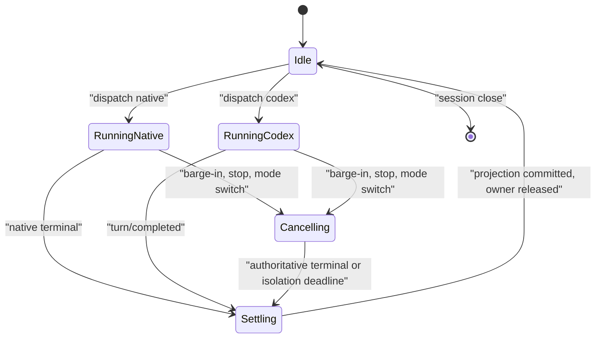

# 小满 DSH + Codex 分阶段实施计划

状态：Phase 0–2 源码完成；Phase 3 seam/protocol 已实现但执行安全门禁关闭；组装与实机验收中
计划日期：2026-08-17
目标平台：macOS，优先 Apple Silicon

## 1. 目标与不可变约束

最终产品保留 DSH 作为 UI、voice、session 和执行路由主体，提供显式
`native`/`codex` 两种 agent mode。Codex 通过 ChatGPT subscription 登录和 App
Server 工作，不要求用户配置 OpenAI API key。

不可变约束：

- 产品 voice/upstream 基线固定为
  `ecd45d66579b379f25a49e1da1c6d90c1ddaf91e`；独立 DSH 依赖审计基线固定为
  `47f943859bef60e4160492346772ded9b24f765a`；升级其中任意一方都必须单独记录；
- 先恢复 macOS native voice baseline，再迁移小满 v3 可复用能力，再接 Codex；
- `CodexSubagentProvider` 是顶层 direct delegation service，不是
  `CodexLLMProvider`，也不通过 native agent tool call 承接显式 Codex mode；
- 一次 user turn 只有一个 agent loop；一个 DSH session 只有一个 active execution；
- 原旧机 `macos-local-voice-agents` checkout 始终只读；不运行、不
  原地改写、不把其 venv/model/cache/未授权资产复制进本仓库；
- 不记录 prompt、音频、credential、raw command/diff/reasoning；默认 metrics 仅有
  hashed correlation id、阶段、字节/字符计数、状态和 duration；
- 每一阶段先通过本阶段 gate 才进入下一阶段。Phase 3 不能成为 Phase 1/2 的隐式
  启动依赖。

架构和协议细节见
[`dsh-codex-boundary.md`](dsh-codex-boundary.md)。

## 2. 当前仓库事实与集成落点

当前仓库已有：

- `bridge/voice_bridge.py`：FastAPI STT/TTS/VAD/media/QQ bridge；
- `dsh-plugin/`：浏览器 mic、session prompt、reply observer、TTS speaker 和 companion
  UI；
- `scripts/start-*.sh` 与 `scripts/smoke-check.sh`：macOS/Linux 启动和无模型 smoke；
- `bridge/xiaoman_v3_adapters/` 与 `assets/xiaoman/`：正在迁移的 provider、取消边界
  和已授权小型资产；
- browser/bridge latency instrumentation 和基础 Python/TypeScript tests。

native voice 投递继续使用 DSH `session.prompt(queue|steer)`。Codex 路径已增加独立
Host package：typed Remote 在 `AgentLoop` 前同步 claim maintenance，先写并 flush
`codex/user`/`codex/delegation-start` durable event，再连接 bridge；浏览器只渲染
ConversationNode，不持有 Codex 控制 WebSocket。该 seam 的源码与 focused/Host
aggregate 测试已完成，pinned DSH 的最终 client/bundle 组装仍是发布 gate。

当前发布面已开放 `read-only` `codex.start`。实机探针证明单进程 stable `read-only`
sandbox 仍能读取 HOME，因此实现使用 managed auth-only App Server 与 credential-free
execution App Server 分离；后者仅经 private stdio 获取 access token，启动 turn 前验证
没有 auth 文件/token 落盘。health/auth/status 与官方 ChatGPT 浏览器登录继续由 auth-only
进程负责；workspace-write 与 approval gateway 仍关闭。

逻辑组件边界如下；除 `ApprovalGateway`/workspace-write 外，其余 read-only slice 已落地：

| 组件 | 责任 | 不拥有 |
| --- | --- | --- |
| `AgentModeStore` | 每 DSH session 的显式 mode 和切换事务 | backend process/thread |
| `TurnDispatcher` | top-level FIFO、execution owner CAS、native/Codex 分流 | Codex wire details |
| `CodexSubagentProvider` | App Server process、schema/auth gate、thread/turn wire | DSH transcript/voice queue |
| `CodexThreadMapStore` | durable mapping、provisional/durable/stale 状态和 CAS | turn events |
| `AgentEventProjector` | backend event → DSH UI/transcript/TTS-safe event | backend execution |
| `ApprovalGateway` | 显示请求、一次响应、超时/cancel fail closed | token/auth refresh |
| `CancellationCoordinator` | audio/TTS 本地停播、backend interrupt、terminal convergence | 两套独立队列 |

### 2.1 原方案“Codex 第一轮立即执行任务”工作包

第一轮顺序不能被后续实现倒置：

| 顺序 | 工作 | 当前证据/完成条件 |
| --- | --- | --- |
| 1 | Locate 小满 v3 并保护来源 | 来源固定为旧机 `macos-local-voice-agents` checkout；审计保持只读。2026-08-22 用户选择真实嘴型后，允许部署启动现成 LiveTalking（不修改代码/模型，运行日志除外） |
| 2 | 在独立目录准备 voice 产品仓库 | 当前独立工作区是本仓库，基线 `ecd45d6` |
| 3 | 配置 upstream remote | `upstream` 指向 `beiyege-01/dsh-voice-ai-girlfriend`；不在本计划执行 push |
| 4 | 完整审计 upstream voice pipeline | 产物 `docs/upstream-architecture.md` |
| 5 | 审计小满 v3 的 VAD/STT/TTS/audio/avatar/voice/macOS helper | 产物 `docs/xiaoman-v3-reuse-audit.md` |
| 6 | 审计 DSH subagent/delegation API | 独立 DSH pin `47f9438`；结论写入边界文档 |
| 7 | 审计 Codex App Server/auth/thread/stream/cancel | 本机 `0.149.0-alpha.4.1` schema 和实机探测写入边界文档 |
| 8 | 显式设计 `CodexSubagentProvider` | 禁止替换为 `CodexLLMProvider`；接口、mapping、events、shutdown 已冻结 |
| 9 | 形成四份 Phase 0 文档 | 本文和其余三份文档各有独立职责，不互相覆盖 |
| 10 | 才开始 Phase 1 | native macOS baseline 独立可运行，不接 Codex |
| 11 | 每阶段独立可运行 | 每个阶段均有 gate 和 native fallback |
| 12 | 优化前先加 latency | Phase 1 先记录原方案 `t0..t9`，Phase 3 再加 Codex 子阶段 |

第一轮的审计/设计项完成不等于 Phase 3 已实现；尤其不能把 live protocol probe 当成
产品 dispatcher、approval UI 或 durable mapping 已交付。

## 3. 阶段与验收门

### Phase 0：审计与设计

交付：

- 固定两个仓库 commit；
- 记录 voice/upstream 架构和小满 v3 复用审计；
- 记录 DSH subagent/session/queue/steer/cancel 语义；
- 记录本机 Codex version、stable/experimental schema hash、ChatGPT auth kind、实机
  handshake、thread resume、stream、steer、interrupt 和 EOF shutdown；
- 冻结 direct delegation 边界、事件模型、mapping、schema 和 cancellation ownership。

验收：

- 四份设计/审计文档互不矛盾；
- 未输出或读取 credential；
- 明确 upstream one-shot 只作 wire/process baseline；
- 明确 agent-inside-agent 的控制流断言和自动化测试方法。

### Phase 1：macOS native voice baseline，不接 Codex

工作：

1. 使用 macOS/Linux launcher 启动 bridge 和外部 DSH 源码树；保留 Windows `.cmd`
   行为；
2. 路径解析、模型 lazy load、Apple MPS/CPU fallback、bridge health 和 browser CORS
   可诊断；
3. 打通 mic → endpoint/VAD → STT → DSH native session → reply → TTS → playback；
4. barge-in 首先同步停止 audio source、清 TTS queue、abort TTS request，再处理 agent
   cancellation；
5. 建立 `t0..t9` latency timeline 和不含内容的 trace correlation；
6. 无真实模型时可运行 import/unit/smoke；真实模型测试由显式环境开关启动。

验收：

- clean checkout 在配置模型前能启动 bridge 并返回 health；缺模型给出可操作错误；
- native 模式完整语音 turn 成功，历史消息不被重新朗读；
- 语音打断后当前音源与待播队列停止，不朗读被取消 turn 的迟到文本；
- `scripts/smoke-check.sh`、Python tests、plugin typecheck/bundle 全部通过；
- 没有 Codex process、auth、schema 或 API key 依赖。

### Phase 2：小满 v3 能力迁移

工作：

1. 只复制来源审计批准的 VAD/audio bus/STT/TTS adapter 逻辑和有明确授权的
   idle/voice 资产；
2. 所有 runtime import 使用本仓库 namespace，不引用来源绝对路径；
3. provider 依赖 lazy import，避免未安装 MLX-Audio/legacy 包时破坏 baseline；
4. 统一 `CancellationToken`、generation stale-drop、TTS chunk cancel 和 VAD event
   形状；
5. listening/thinking/speaking 没有授权独立片段时回退到 idle，不生成伪 provenance；
6. model、venv、node_modules、LiveTalking cache 和未验证素材不入仓库。

验收：

- 来源目录 `git status`/mtime 审计无变更；
- `rg` 不存在来源绝对路径 runtime import；
- fake loader/provider tests 覆盖 prewarm、序列化、取消、empty output、VAD
  reopen/commit、audio bus stale drop；
- 资产 hash、规格和授权摘要均在目标 manifest；
- idle/listening/thinking/speaking 四种产品状态都能转换；没有授权独立视频的状态按
  manifest 回退到 idle，不阻断状态机；
- Phase 1 native baseline 回归通过。

### Phase 3A：Codex stable protocol client

工作：

1. 解析可执行文件来源并检查 `codex --version`；优先使用产品配置/ChatGPT.app
   发现结果，不在 wire 层硬编码用户路径；
2. 构建时由目标 binary 执行 `generate-json-schema`，编译 stable generated types；
3. shared subprocess seam 启动一个受管 `codex app-server --stdio`；
4. 实现 JSONL correlation、single initialize/initialized、early-event buffering、exact
   id filtering、known request dispatch、unknown request fail closed；
5. 启动 gate 用 `account/read {refreshToken:false}` 验证 managed ChatGPT account kind；
   绝不读取或存储 token；
6. 实现 draining/EOF/TERM/KILL shutdown，禁止伪造 shutdown RPC。

验收：

- schema compile/manifest hash 与支持版本一致；experimental method 在类型和运行时均
  不可调用；
- handshake 顺序错误、重复 initialize、malformed frame、foreign ids、unknown
  request 均有 deterministic contract test；
- signed-out、API-key mode、外部-token refresh request 均 fail closed 并给安全提示；
- process crash、stdout EOF、stdin EPIPE、grace timeout 都回收整个 process tree；
- logs/snapshots 不含 cwd、thread id、prompt、auth payload 或 server raw frame。

### Phase 3B：顶层 direct delegation 与持久 thread

工作：

1. 在 DSH host 的 pre-AgentLoop seam 注册 `AgentModeStore` 和 `TurnDispatcher`；
2. Codex mode 从产品 FIFO 直接调用 `CodexSubagentProvider`；不创建 native DSH
   `Agent` turn；
3. `thread/start(ephemeral:false)`，实现
   `DSH session → Codex thread` provisional/durable/stale mapping；
4. 首个 durable turn 后原子 commit；进程/应用重启后 `thread/resume`；cwd
   fingerprint 变化时新建，不跨 workspace 复用；
5. 每 thread 串行 turn；不同 thread 的并发由有界 capacity 控制；
6. native/Codex mode switch 必须 interrupt、等待 terminal、release owner 后才能
   commit 新 mode。

验收：

- Codex-mode E2E 的 native LLM 和 DSH tool dispatcher fail-on-call sentinel 保持
  0 次调用；
- 同一 DSH session 的两个并发请求只有一个 active owner，另一个进入 FIFO；
- App Server 重启后 resume 已完成 turn 的 thread，历史连续；
- start-only 未物化 thread 的 no-rollout 恢复能标 stale 并安全新建；
- cwd mismatch 不 resume 旧 thread；mapping race 无双写/孤儿 active thread；
- native 模式原行为不受影响。

### Phase 3C：stream、approval、steer 与 cancellation

工作：

1. 将 `turn/started`、agent delta、tool activity、approval、terminal 映射到统一
   `AgentEvent`；
2. 建立 item phase registry；UI 可显示 commentary/final，TTS 只接受已知 final
   answer；unknown phase 在 completion 前保持静音；
3. `ApprovalGateway` 支持 command/file/permission/user-input/MCP 的一次性响应、
   turn/session scope、timeout 和 cancel；
4. same-turn steer 要求 exact `expectedTurnId`；stale race 返回 typed error，不在
   provider 内自动降级为 queue；
5. barge-in 使用 `turn/interrupt`，不是 steer；interrupt response 后继续等待
   `turn/completed: interrupted`；
6. event channel 有界，text delta 可合并；terminal/approval/error 永不丢；
7. 投影只存可见 answer 和安全 metadata，不复制 Codex internal reasoning/tool trace
   到 DSH prompt context。

验收：

- response-before-notification 和 notification-before-response 两种顺序结果一致；
- final answer delta 连续显示/朗读且无重复；commentary、code、diff、command output、
  reasoning 不朗读；
- approve/decline/cancel/accept-for-session、permission subset、UI timeout 和 unknown
  request 均通过；
- interrupt 只 settle 一次，迟到 delta 不显示/不朗读；pending product queue 保留并
  在 terminal 后只 drain 一条；
- 断线、process crash、approval pending 时 shutdown 都能达到 quiescence。

### Phase 4：显式双 Agent mode 与性能验证

工作：

1. UI 显示明确 `native`/`codex` mode；切换中状态不可提交新 backend turn；
2. THINKING/TOOL/SPEAKING/INTERRUPTING 等状态只由统一事件驱动；
3. 对短问、普通问答、coding、连续打断运行固定 benchmark；
4. 统计端到端、backend 和 voice 子阶段，不混淆“本地静音”与“远程 terminal”；
5. 形成支持的 macOS/Codex CLI 版本矩阵和回滚开关；
6. 输出 `docs/performance-report.md`。该文件是 Phase 4 交付，本轮只定义其输入和
   验收，不提前创建空报告。

验收批次：

- 20 个短问；
- 10 个普通问答；
- 10 个 coding 任务，包含工具和文件审批；
- 10 个 interruption/race 场景，覆盖 STT 中、等待 backend、delta 中、TTS 中、
  approval 中、mode switch 中。

发布 gate：

- 两种 mode 各自完整工作，Codex mode 不触发 native loop；
- ChatGPT 登录可用且没有 API key 要求；
- durable resume、queue、approval、interrupt、crash recovery 均通过；
- barge-in 到本地 audible stop p95 `<150 ms`；remote interrupt RPC ack、Codex
  terminal、下一 turn start 分别统计，不用其中任意一个替代 audible-stop 指标；
- 无重复 turn、重复 TTS、交叉 thread event 或 credential/content telemetry。

### Phase 5：可选自动 router

只有 Phase 4 稳定后才评估。router 只能在 user turn 开始、owner 为 idle 时选择
native 或 Codex；其 decision 本身不是另一个生成式 agent loop。V1 默认不做自动
router，用户显式 mode 是可解释、可回滚的产品边界。

## 4. Schema version strategy

### 4.1 Manifest

仓库应提交一个小型 protocol manifest，而不是把“最新 Codex”当兼容范围：

```json
{
  "manifestVersion": 1,
  "surface": "stable",
  "codexCliVersion": "0.149.0-alpha.4.1",
  "schemaBundle": "codex_app_server_protocol.v2.schemas.json",
  "schemaSha256": "9b3de71a5a2ffc980b792a18aa8f8dec3f85f48829560222a0264fe494b679a9",
  "experimentalApi": false
}
```

manifest 还应由 generated types/contract tests 固定 required wire：
`initialize` request、`initialized` client notification、`account/read`、
`account/login/start`、`account/login/cancel`、`thread/start`、`thread/resume`、
`turn/start`、`turn/steer`、`turn/interrupt`、`remoteControl/status/changed`、
`account/login/completed`、terminal/item/delta notifications，
以及实际支持的 approval request/response。生成前必须先让同一 binary 输出 exact
canonical `codex-cli 0.149.0-alpha.4.1`；banner 不匹配或 malformed 时不得运行 generator
或创建输出目录。

### 4.2 Runtime gate

- 默认只接受 manifest 明确测试过的 exact CLI build；若以后声明 semver range，必须
  先证明 range 内多个 binary 的 generated-schema 和 live contract；
- production bridge 的 `expected_cli_version` 必须精确等于 manifest pin；null/其他值在
  AppServerClient 构造和进程启动前拒绝。部署 gate 继续用 fresh generator 的 canonical
  `codex --version` banner attestation，不允许以运行时配置绕过；
- production bridge 还必须在任何 AppServerClient 构造前按 JSON 原始类型验证 timeout/queue
  配置：bool、null、string、NaN/Infinity、integral float queue 和超界值全部 no-spawn 拒绝，
  禁止通过 Python `float()`/`int()` 把 bool 隐式变成 `1`；
- initialize response 的 `userAgent` 必须完整匹配 Codex 官方
  `originator/version (OS; arch) terminal (client; client-version)` grammar，且 originator/
  suffix 都绑定固定 DSH `clientInfo`；不得从任意 banner 子串提取版本后放行；
- 版本不匹配时显示 `codex-version-unsupported` 和安装/升级建议，不尝试按字段猜测；
- initialize response 解析失败、required method/enum/status 缺失、auth kind 不是
  managed ChatGPT 时不 publish provider ready；
- runtime 启动/首个 frame 前校验 checked-in v2 bundle SHA-256 与完整 JSON tree
  digest，并用固定 `jsonschema==4.26.0` 的 Draft 7 validator；出站不接受 generated
  95-method union，只允许 manifest 中九个业务 method 与 `initialized`；
- 每个出站 request 的 params 和 pending response result 都按原 method 的独立 generated
  schema 校验；额外 policy 禁止 token refresh、API-key/raw-token login、write sandbox、
  approval 与 experimental/attestation opt-in；
- 入站 server request/notification 先过 generated envelope 再过业务 allowlist；known 或
  future well-typed request 只发送 typed deny，只保留有界 routing id、不消费/回显其他 params；malformed request、
  malformed notification 与 unknown notification 均 fail closed 并隔离 app-server；
- JSONL reader 使用封闭 envelope 分类：response 必须 `result`/`error` 二选一且 id 是本地
  pending/有界 tombstone 整数，request/notification 只能带 generated envelope 字段；notification
  精确允许 generated top-level `emittedAtMs`。重复 JSON key（含嵌套）、NaN/Infinity、id-only、
  result-only、mixed envelope 和未知 response id 都在解释业务字段前验证隔离，错误不回显 raw frame；
- generated string 仍需业务上限：thread/turn id 最长 512，item/login id 最长 256，auth URL
  最长 2048 且只允许固定官方 OAuth path/loopback callback。thread start/resume response 还必须
  证明 top-level/thread cwd 与请求 workspace 相同、`ephemeral=false`、CLI pin 精确一致；resume
  返回 id 必须等于持久化请求 id，任何偏差都不能改写 mapping 或继续 turn/start；
- exact 0.149.0-alpha.4.1 在首个 `account/read` response 前发送 generated-stable
  `remoteControl/status/changed`；它只在完整 schema 校验后被显式丢弃，不广播、不解释其中
  server/installation/environment identity；真实 0.149 帧可带 generated `emittedAtMs`，只由
  envelope/schema 校验消费。真实 method-only auth probe 还覆盖
  `account/login/start` 与 cleanup cancel，不记录 account、credential、URL、path 或 payload；
- generated stable 的 wire `process/exited` 只表示本产品未调用的 `process/spawn` 已终止，
  因而不属于 required/runtime notification allowlist；收到它必须 fail closed 隔离，且在
  owned process group 验证终止前不得释放 thread mapping。App Server 自身生命周期仅由
  internal-only `dsh/app-server/exited`（或独立 isolation-failed sentinel）表达；
- schema 错误只使用固定类别，不含 raw frame、validator path、cwd、prompt 或账号 payload；
  unknown terminal status、unknown approval decision 同样 fail closed；
- browser login completion 使用有界 early-terminal claim buffer，覆盖 notification-before-response
  和 response-Future-before-caller-resume；同一 loginId 的冲突终态隔离进程，internal App Server
  exit/isolation-failed 会立即失败所有 pending login。Host isolate ACK 区分 `released`（仅安全
  completed ledger）与 `isolated`（仅进程组已验证终止），false ledger 永不伪装成功；WS
  `turn/released` 同样必须查询 exact session/execution release ledger/event，不能从 stream generator
  exhaustion 推断，`isolation_failed` execution 永不发送该 release frame；
- `account/login/start|cancel` 写入后 timeout/EOF 属于 ambiguous remote auth ownership：不得自动
  retry，必须有界隔离当前 AppServer generation 并把全部 pending login 改为固定、无 URL 的失败。
  pending login 不参与 TTL/LRU eviction；已有 pending 时拒绝新的 start，直到 terminal/cancel/isolate；
- Host→bridge login start 只接受 closed body `{operation_id}`，其中 id 是 canonical lowercase
  UUIDv4。bridge 在 App Server write 前注册 process-lifetime、64-entry hard-cap operation owner；
  同 id 并发、HTTP abort 后重试与 reconcile 都 shield/join 同一 task 并返回同一 loginId，不能创建
  第二个 remote flow。pending 时 foreign id 固定拒绝，owner（含 terminal/error）不做 TTL/LRU
  eviction；容量满、远端 loginId 跨 operation 复用或 owner 冲突均 fail closed，后者先有界隔离；
- schema-invalid auth response 虽会先失败 response Future，auth operation lock 仍必须 join 同一
  generation 的 teardown，确认进程组静默后才允许下一次请求；已有 protocol exit hint 不得被
  竞争 isolate 覆盖。仅 reserve、尚未进入 stream dispatch 的 execution 可在 state lock 内原子
  cancel 并写 true release ledger；一旦可能 dispatch，或 reservation 已 terminal/poisoned，就保留
  ownership 并走 verified isolation/reconciliation，不能删除成 unknown；
- 真实 0.149 empty non-ephemeral thread 的 resume 错误只按 canonical
  `no rollout found for thread id <expected-id>` 分类（仅允许规范终止句点）；消息中的 id 必须精确
  等于本次 persisted request id。generic/embedded/foreign-id 文本不得触发 mapping 删除或重建；
- stdout EOF、wait callback、显式 isolate 和 shutdown 按 process generation 共享单次终止结果；
  每次 signal/await 后重新验证 generation，旧 callback 不得终止或发布新进程的生命周期事件。
  stderr 只用固定 16 KiB chunk 持续丢弃，禁止记录内容，也不允许超长无换行诊断堵塞 child pipe；
- 已权威 `completed` 且 durable mapping commit 成功后，late verified AppServer exit 只终止该进程代，
  必须保留 mapping 供重启后 exact resume；不得留下 completed/true-release ledger 却删除历史。
  同一 thread/turn pair 的 `turn/completed` 仅允许 params 语义完全相同的重复帧（忽略 top-level
  `emittedAtMs`）；任何冲突即使首终态已缓存，也必须把 exact execution ledger 降为 poisoned、
  verified isolate 当前 AppServer 并清理 mapping，禁止 silent first-wins；
- Host control body 禁止额外字段并限制 id 长度；若同时提供 session/execution/thread/turn，四者必须
  指向同一 provider state，partial pair 或 mixed identity 在任何 interrupt/isolate 副作用前拒绝。
  bridge shutdown 即使上层 agent/auth cleanup 失败也必须在有界阶段内调用 exact client close；
- experimental schema 只生成用于 semantic diff，运行时初始化仍明确 false。

### 4.3 升级流程

1. 固定候选 Codex binary version；
2. 分别生成 stable/experimental schema 和 SHA-256；
3. 做 semantic diff：methods、required fields、enums、nullable、approval 和 event
   payload；
4. 重新生成 types，不手改 generated code；
5. 跑 fake App Server contract tests和真实 handshake/resume/stream/interrupt/approval
   smoke；
6. 更新 manifest、兼容矩阵和变更记录；
7. 只有 CI 与 macOS E2E 全绿才扩展支持版本。

本次 `0.149.0-alpha.4.1` 证据：stable 291 文件，v2 bundle SHA-256 为上表；
experimental 363 文件，SHA-256
`a0d6da21a99d629299982c5a63971bb3fd1e242e26503e07d819505436250727`。
DSH upstream one-shot 使用 `0.147.0`，所以升级流程是 Phase 3 的前置条件，不是后续
清理项。

## 5. Cancellation ownership 与状态机

### 5.1 单 owner 状态机



`interrupt()` 的 RPC response 只表示请求被接受；不能从 Cancelling 直接跳 Idle。
必须收到 authoritative terminal，或在 deadline 后证明旧 process/connection 已隔离。

### 5.2 Ownership table

| 资源/动作 | 唯一 owner | 取消行为 |
| --- | --- | --- |
| browser audio source 与 TTS FIFO | voice speaker | 同步 stop source、清 queue、使 generation 失效 |
| TTS HTTP/generation | voice bridge client/token | abort request；model 不能强杀时丢弃迟到 generation |
| top-level user FIFO | `TurnDispatcher` | barge-in 默认保留；“停止全部”才显式清空 |
| DSH native active turn | DSH native adapter | `cancel/interrupt`，普通 barge-in keep inbox |
| Codex active turn | `CodexSubagentProvider` | exact `turn/interrupt`，等待 `turn/completed` |
| execution state transition | `CancellationCoordinator` | CAS 一次，只有它 release owner/drain 下一条 |
| approval request | `ApprovalGateway` | turn cancel/shutdown 时一次性 cancel/decline |
| App Server process tree | shared subprocess owner | EOF → TERM → KILL，await `done` |

严禁 speaker、dispatcher 和 provider 各自都“顺便开始下一 turn”。只有 coordinator 在
terminal projection 完成后通知 dispatcher drain。

## 6. 测试矩阵

### 6.1 Unit 与 property tests

| 领域 | 必测用例 | 关键断言 |
| --- | --- | --- |
| JSONL wire | partial/multiple frames、bad JSON、duplicate/unknown id、EOF/EPIPE | 不串 response；fatal 一次；无 unhandled rejection |
| handshake | business-before-init、重复 init、missing fields、experimental false | 不 publish ready；资源已清理 |
| event reducer | delta merge、item phase late/unknown/null、duplicate completion | exact final text；TTS 不越权；terminal once |
| id routing | foreign thread/turn/item、early notification、stale approval | 跨 session 事件为 0；早到事件原序重放 |
| mapping | CAS race、provisional crash、stale/no-rollout、cwd mismatch | 一个 winner；无错误 resume/覆盖 |
| queue | FIFO、cancel keep/clear、steer stale、mode switch race | 不丢/不重放；一个 active owner |
| cancellation | before-start、during-start、during-delta、after-terminal、重复调用 | 幂等；迟到事件不 speakable |
| approval | 每个 known kind、subset grant、timeout、double response、unknown | 一次响应；最小权限；unknown fail closed |
| logging | error payload、cwd/thread/prompt/token-shaped fixtures | 只有 allowlist safe fields |

### 6.2 Fake App Server contract tests

至少脚本化这些顺序：

1. initialize response → initialized；
2. `turn/started` 先于 `turn/start` response；
3. item delta/completed 先于 response，随后正常 terminal；
4. commentary → tool activity → final answer；
5. `phase:null` legacy fallback；
6. approval request并接受、拒绝、取消、超时；
7. request 指向 foreign id；
8. interrupt response → delayed interrupted terminal；
9. interrupt 与 natural completion race；
10. process exit before publication、mid-turn、pending approval 和 after terminal；
11. shutdown 时 child 忽略 EOF，触发 TERM/KILL fallback；
12. unknown method/status/enum 和 schema-invalid payload。

### 6.3 真实 Codex integration tests

默认不在普通 CI 运行，需要本机显式开关，并严禁输出账号/内容：

| 场景 | 验证 |
| --- | --- |
| login/account | `Logged in using ChatGPT`；account kind `chatgpt`；不刷新/打印 token |
| initialize | stable、experimental false、response required fields |
| ephemeral negative | restart 后不能 resume，证明 V1 不可使用 ephemeral |
| non-ephemeral start-only | restart 后 no rollout，mapping 保持 provisional/stale recovery |
| non-ephemeral completed | restart App Server 后 resume 同一 thread/turn history |
| simple streaming | delta、final item、completed terminal 顺序收敛 |
| steer | active expectedTurnId 可接受；不宣称取消或低延迟 |
| interrupt | exact active ids，terminal status interrupted |
| EOF shutdown | stdin close 后正常 exit；无 shutdown RPC |
| approval smoke | 在隔离临时 workspace 触发，UI decision 与实际 server response 一致 |

测试只能创建自己带 marker 的临时 thread/workspace；cleanup 只能精确删除本次测试
创建的对象，绝不枚举后批量删除用户 thread。

### 6.4 产品 E2E 与平台矩阵

| 维度 | 最小矩阵 |
| --- | --- |
| agent mode | native、Codex、idle switch、active switch |
| input | typed text、STT short/long、rapid consecutive utterances |
| backend phase | waiting、commentary、tool、approval、final delta、terminal |
| interruption | STT overlap、thinking、tool、approval、TTS、process crash |
| queue policy | barge-in keep queue、stop-all clear queue、steer stale→typed error |
| persistence | app reload、DSH host restart、App Server restart、cwd changed |
| machine | Apple Silicon macOS 主线；Intel macOS 若声称支持则单列验证 |
| Codex CLI | exact manifest version；unsupported older/newer rejection |
| auth | managed ChatGPT signed-in、signed-out、API-key-only/incompatible |

## 7. 性能指标

原执行方案的 `t0..t9` 是跨 backend 的稳定 voice timeline，名称和含义不得重用：

| 标记 | 事件 |
| --- | --- |
| `t0` | user speech start |
| `t1` | user speech end |
| `t2` | final STT text ready |
| `t3` | DSH/top-level dispatcher received text |
| `t4` | selected agent backend dispatched |
| `t5` | first safe agent text |
| `t6` | first speakable sentence assembled |
| `t7` | first TTS request/generation start |
| `t8` | first audio ready |
| `t9` | first audio actually played |

原方案派生值保持不变：

```text
endpoint_latency  = t2 - t1
agent_ttft        = t5 - t4
tts_latency       = t8 - t7
perceived_latency = t9 - t1
```

Codex 另记：thread ensure/resume、turn/start RPC、first event、first final-answer delta、
每个 tool activity duration、approval wait、interrupt RPC ack、interrupted terminal 和
process recovery。为避免污染稳定 timeline，这些使用 `codex.*`/`backend.*` 名称；
backend final completion 和最终 transcript commit 也使用独立 marker，不能占用 `t9`。
Codex 子阶段应能拆出 delegation overhead、App Server dispatch、first event、first
assistant text、tool execution 和 final completion，从而比较 DSH overhead、Codex
overhead 与 model/tool overhead。

此外独立记录：

- barge-in → local audible stop：独立高精度计时，目标 p95 `<150 ms`；
- barge-in → interrupt ack、→ remote terminal、→ next turn start：三个独立指标。

不要把“远程 turn 很快 interrupted”当成听感指标，也不要为了 `<150 ms` 等待网络或
App Server；先本地静音，再异步收敛 backend。

## 8. 风险、缓解与阻断条件

| 风险 | 影响 | 缓解/阻断条件 |
| --- | --- | --- |
| DSH 0.147 provider 与本机 0.149 alpha schema 漂移 | wire/approval 在升级后静默错配 | exact manifest、generated types、semantic diff；不匹配阻断 provider ready |
| Host durable seam 回归成 upstream one-shot/tool provider | 形成双 agent 或丢失 session transcript | 已建独立 Host service；继续以 fail-on-native-call、maintenance 与 durable catalog E2E 作发布 gate |
| Host/Remote/persistence overlay 随 DSH 升级漂移 | browser 绕路、native transcript 污染或重启拒绝 catalog | installer 固定七个锚点与 catalog hash；任一 drift fail closed，升级时重新审计 |
| delta 不带 phase | commentary/status 被朗读 | item registry + unknown buffer + completed reconciliation |
| approval UI 未完成 | coding turn 悬挂或过度授权 | known request typed gateway；未完成前默认拒绝并不宣称 feature ready |
| managed ChatGPT 登录失效 | Codex mode不可用 | auth gate、安全登录指引、native mode 可继续；绝不 fallback 到隐藏 API key |
| mapping 首 turn 前不落盘 | restart 后 no rollout | provisional 状态、首次 durable terminal commit、not-found recovery |
| crash/cancel 竞态 | 双 terminal、双 turn、迟到 TTS | CAS owner、terminal once、generation invalidation、process isolation deadline |
| 长驻 App Server 资源/协议损坏 | 影响多个 session | per-thread isolation、health state、停止接单、统一 restart；不在旧连接上盲重试 turn |
| telemetry 泄露本地内容/凭据 | 隐私和安全事故 | allowlist fields、hash ids、secret-shaped fixture tests、raw frame logging 禁止 |

当前真正的 Phase 3/4 阻断条件是：

1. stable `read-only` 没有可证明的 credential-path read deny；必须有官方可验证的
   permission profile 或独立 OS principal/broker，并以真实探针证明 auth 可用而 tool
   process 无法读取认证路径；在此之前 turn hard gate 不得解锁；
2. interactive ApprovalGateway 尚未完成 request/session/execution CAS、先 durable
   decision 再单次 wire response、timeout/cancel typed deny，以及 command/file/
   permissions/user-input/MCP 支持矩阵；因此不能宣称 coding 已支持；
3. pinned DSH overlay 必须完成 clean Host/client bundle、catalog/lock 二次幂等和真实
   browser assembly；focused 源测试不能代替该 gate；
4. 真实麦克风、MLX STT/TTS、audible-stop p95、thread/resume/interrupt/coding 和
   20/10/10/10 矩阵尚未执行，性能报告必须继续保留 0 次而不能用单测补数。

pre-AgentLoop Host seam、durable `codex/*` catalog、thread mapping、exact
0.149 stable generated schema/version/runtime validator 和 auth/login 已实现；它们不再
列为“尚未找到”的设计阻断，但也不会绕过上述安全与验收条件。

## 9. 回滚与降级

- 功能开关默认 `native`；Codex provider 启动/auth/schema失败只禁用 Codex mode，
  不影响 bridge、STT/TTS 或 native DSH；
- mode 选择持久化与 thread mapping 分开。回滚 provider 不删除 Codex thread；
- schema/version gate 失败不自动改用 API key、不启 experimental、不切回 upstream
  ephemeral one-shot；
- deployment rollback 先进入 draining、interrupt active turn、停止 TTS、等待或隔离
  App Server，再卸载 extension；
- mapping migration 必须向前兼容读取或显式备份/迁移，不能在回滚时批量删除历史。

## 10. Definition of done

Phase 4 发布必须同时满足：

- Phase 1/2 全部验收项和回归测试通过；
- Codex stable protocol manifest、generated types、fake contract 与真实 smoke 一致；
- managed ChatGPT auth，无 credential 读取/输出/持久化；
- explicit Codex mode 通过 fail-on-native-LLM/tool sentinel；
- persistent thread、跨进程 resume、provisional/no-rollout、cwd mismatch 恢复通过；
- final-answer-only TTS、approval、queue、steer、interrupt、shutdown 和 crash recovery
  通过完整矩阵；
- 20/10/10/10 benchmark 完成，audible-stop p95 `<150 ms`，各 latency 阶段可分别
  定位；
- unsupported Codex version 和 signed-out 状态安全降级到“Codex mode unavailable”，
  native voice baseline 仍可用；
- 文档、运行命令、支持矩阵和已知限制与实际实现一致。
