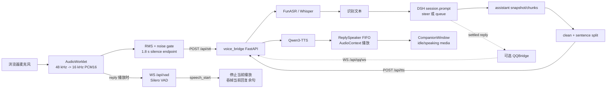

# Upstream voice architecture and macOS baseline

状态：Phase 1 macOS baseline（不接入 Codex）

> 当前发布边界：本文记录 upstream/Phase 1 pipeline；QQ/OneBot 端点虽保留在代码中，
> 默认硬关闭且尚未完成 capability、body/frame 上限与隐私复核，不属于支持面。
> Codex 的后续 Host-owned durable seam 见
> [`dsh-codex-boundary.md`](dsh-codex-boundary.md)，浏览器直连不属于当前架构。

本文审计 `dsh-voice-ai-girlfriend` 当前 upstream 实现，并记录本分支为
macOS 可运行入口、路径/设备兼容性和 voice-turn latency 观测所做的最小改动。
DSH 仍然是对话编排方；本仓库的 bridge 只提供 STT、TTS、媒体和可选 QQ/VAD
服务。

## 1. 范围与边界

### 包含

- 浏览器中的 DSH Voice Plugin：麦克风采集、静音端点、barge-in、session
  prompt、回复句子切分、TTS 播放、动画窗和可选 QQ bridge。
- `bridge/voice_bridge.py`：FastAPI HTTP/WebSocket 服务，以及懒加载的
  FunASR/Whisper STT、Qwen3-TTS、Silero VAD、媒体目录和 OneBot 适配。
- `scripts/start-bridge.sh`、`scripts/start-dsh.sh`、`scripts/start-all.sh`：
  macOS/Linux 入口。Windows `.cmd` 入口保留给 upstream 的 Windows/NapCat
  流程。
- bridge 日志和浏览器 console 中的结构化 latency 事件。

### 不包含

- 不修改 DSH 的 agent/模型路由，也不注入 Codex、API key 或 provider URL。
- 不把 Python bridge 改造成完整 VAD → LLM → TTS agent；LLM turn 仍由 DSH
  session 服务执行。
- 不在 macOS 启动 NapCatQQ。NapCat 的 QQ 注入、OneBot HTTP/WS 配置属于
  Windows 专用 upstream 路径。

## 2. 总体数据流



一次语音 turn 的职责边界如下：

| 阶段 | 所在代码 | 输入/输出 | 关键约束 |
|---|---|---|---|
| 采集 | `dsh-plugin/src/client/voice/recorder.ts`、`worklets/mic-capture.ts` | 麦克风 → 16 kHz PCM16 chunks | 浏览器权限；AudioWorklet；RMS endpoint |
| 打断侦测 | `bridge.ts`、`voice_bridge.py::VADSession` | PCM16 WS → `speech_start` | VAD 模型在本地 `models/silero-vad`；每个 WS 独立状态 |
| STT | `bridge.ts` → `/api/stt` | PCM16/WAV → `{text, language}` | bridge 的 `infer_lock` 串行化 STT/TTS |
| 对话投递 | `dsh-plugin/src/client/index.ts` | text → `session.prompt` | running + interrupt 开关时 `steer`，否则 `queue` |
| 回复观察 | `voice/reply-listener.tsx` | assistant snapshot → sentences | settled 才 flush trailing partial；历史 baseline 不重播 |
| TTS | `bridge.ts` → `/api/tts/stream` | sentence → 16 kHz mono PCM16 chunks | 第一块生成即返回；AbortController 支持打断 |
| 播放 | `voice/speaker.ts`、LiveTalking WebRTC | PCM → 连续 AudioContext 时间线；小满 A/V 共用 WebRTC | 跨句按精确结束时间排队；`stop()` 清队列并中断 source |
| UI/媒体 | `voice/companion.tsx` | speaker state + `/api/media/*` | idle/task 视频轮播；pointer handle 可调宽 |
| QQ（可选） | `voice/qq-bridge.tsx` + bridge QQ endpoints | inbound/outbound text/voice | 单浏览器 WS；NapCat/OneBot 不是 macOS baseline |

## 3. Bridge 生命周期与配置

`voice_bridge.py` 在 import 时创建 FastAPI app，但模型不会立即加载：

1. 配置路径优先使用 `VOICE_BRIDGE_CONFIG`，其次是 `bridge/bridge-config.json`。
2. 若本地配置不存在，回退到提交的 `bridge-config.example.json`，因此新
   checkout 可以先启动并访问 health/media；第一次 STT/TTS 仍会因模型路径是
   示例值而失败，需用户补齐模型配置。
3. 每种模型第一次请求时在后台线程加载。`ModelManager._load_lock` 防止重复
   加载；`infer_lock` 串行化所有 STT/TTS 推理，因为默认是单用户本地机器。
4. `stt.backend` 为 `funasr` 时 `model_name` 是本地路径；`whisper` fallback
   的 model id 不做路径归一化。
5. 相对模型、参考音频、媒体路径以仓库根目录为基准。Windows drive path
   在 macOS/Linux 上不会被错误拼接成 `<repo>/C:/...`。

### 设备选择

配置可写 `"device": "auto"`。bridge 会按当前 PyTorch 能力选择：CUDA →
Apple MPS → CPU。旧配置中的 `cuda` 在没有 CUDA 时会记录 warning 并回退到
MPS/CPU；CPU 下 `float16` 自动改为 `float32`。这解决了原始示例配置在
Apple Silicon 上 import 后首次模型加载即失败的问题，但不保证 Qwen3-TTS
及其依赖的每个算子都支持 MPS；遇到算子不兼容时把设备固定为 `cpu` 是
可靠 fallback。

### HTTP/WebSocket API

| 路径 | 方法 | 作用 |
|---|---|---|
| `/api/health` | GET | 服务、STT/TTS lazy-ready、解析后设备、latency 配置 |
| `/api/stt` | POST | `audio/wav` 或 16 kHz raw PCM16；支持 `X-Max-Audio-Sec` |
| `/api/tts` | POST | `{"text":"..."}`；返回 WAV，支持客户端断开取消 |
| `/api/tts/stream` | POST | `{"text":"...","turn_id":"...","generation":0}`；返回 16 kHz mono PCM16 chunked body |
| `/api/media/bg-images` | GET | idle 媒体索引 |
| `/api/media/task-videos` | GET | speaking 视频索引 |
| `/media/bg-images/*` | GET | 静态媒体（浏览器 `<video>` 使用） |
| `/media/task-videos/*` | GET | 静态媒体 |
| `/api/vad` | WS | 客户端 PCM16 → `speech_start`/`speech_end` |
| `/api/qq/ws` | WS | 插件 ↔ bridge 的 QQ inbound/reply 通道 |
| `/api/qq/event` | POST | NapCat OneBot HTTP 上报入口 |
| `/api/qq/send`、`/api/qq/image` | POST | 可选 QQ outbound |

STT 返回的 JSON 包含 `trace_id`；TTS 返回 `X-Voice-Trace-Id`。客户端可用
`X-Voice-Trace-Id` 传入自己的相关 id。

## 4. DSH Voice Plugin hooks

插件只使用 upstream 的 client plugin/slot/session contract：

1. `src/client/index.ts::apply(ctx)` 注册 `voice` locale，并把组件注入
   `conversation.input.left`。各组件是并列 seat，不替换 DSH 原生输入框。
2. `ctx.sessions.binding(sessionId)` 得到 session-scoped conversation service。
   `sendText` 根据 session snapshot 的 `running` 和
   `s2s.voice.interrupt` 选择 `session.prompt([{type:'text', text}], mode)`。
3. `ReplySpeakerMount` 用 `useSession((s) => s)` 订阅每次 snapshot publication，
   读取 `assistant-step` 的 text blocks。它维护 history baseline、每 node 的
   已播句数和 barge-in skip anchor，避免重播旧历史或误吞新回复。
4. `VoiceInjected` 是 plugin-private face：`sendText`、共享
   `ReplySpeaker`、`CompanionController`、TTS abort 和 interrupt handler。
5. `BridgeStatus` 每 30 秒探测 `/api/health`；bridge down 时只显示警告，不会
   让 DSH 页面崩溃。浏览器仍必须允许麦克风和 localhost fetch。

当前 slot 注册顺序为：

```text
voice-mic (80)
voice-bridge-status (83)
voice-qqpush-toggle (84)
voice-toggle (85)
voice-companion-toggle (86)
voice-busy-toggle (87)
voice-reply (90, hidden)
voice-companion (95)
voice-qq-bridge (96, hidden)
```

## 5. Latency instrumentation

### Bridge event

配置：

```json
"latency": {
  "enabled": true,
  "sample_rate": 1.0
}
```

`bridge/latency.py` 用标准 logger 输出单行 JSON，不记录音频或用户文本。典型
事件：

```json
{
  "event": "voice.latency",
  "operation": "stt",
  "trace_id": "...",
  "status": "ok",
  "duration_ms": 183.42,
  "stages_ms": {
    "request_body": 0.31,
    "decode": 2.18,
    "model": 180.91
  },
  "audio_bytes": 64000,
  "timestamp": 1700000000.0
}
```

TTS 的阶段为 `model`、`wav_encode`，并带 `text_chars` 和 `audio_bytes`。失败、
HTTP 4xx/5xx、客户端 abort 也结束 span。`sample_rate` 在 `0..1` 之间裁剪，
适合本地调试或降低长期日志量。

### Browser event

插件在 `dsh-plugin/src/client/latency.ts` 记录 console.debug JSON 事件：

- `stt.http`：请求总耗时、状态和 PCM bytes；
- `turn.send`：STT 返回后到 `session.prompt` 完成的耗时；
- `reply.sentence` / `tts.http`：每句回复的生成请求；
- `speaker.enqueue` / `speaker.playback`：排队、解码和实际播放。

浏览器端默认开启；设置 `localStorage['s2s.voice.latency']='0'` 关闭。bridge
端和浏览器端开关独立，方便在不改 server 日志级别的情况下观察 UI。事件只
带 trace、序号、字符/字节数和耗时，不带识别文本。

## 6. macOS 运行与依赖

### Python bridge

在仓库根目录：

```bash
python3 -m venv .venv
.venv/bin/python -m pip install -r bridge/requirements.txt
cp bridge/bridge-config.example.json bridge/bridge-config.json
# 编辑 bridge-config.json：设置 FunASR 本地目录、Qwen3-TTS 目录、ref_audio
./scripts/start-bridge.sh
```

`speech-to-speech==0.2.10` 提供 upstream handler，并带来 PyTorch、
torchaudio/transformers 等传递依赖；FastAPI/uvicorn 提供 HTTP；soundfile 和
scipy 负责 WAV 解码与采样率转换；FunASR/ModelScope 提供中文 STT/model
下载工具；`pilk` 只在启用 QQ 语音发送时需要。模型权重不入 git：

```text
models/funasr/<paraformer-dir>/
models/silero-vad/silero_vad_v4.jit   # 或 silero_vad.jit
<Qwen TTS directory>                  # tts.model_name 可为绝对路径
ref_audio.wav
```

### DSH Web 与插件

需要 Node.js LTS、pnpm，以及一份已 `pnpm install` 的 deepseek-harness 源码树。
按 `dsh-plugin/README.md` 把插件放入
`<HARNESS>/packages/client/ui-voice/`，在 harness 的三处清单注册并构建：

```bash
cd "$DSH_HARNESS"
pnpm install
pnpm exec tsc -b packages/client/ui-voice/tsconfig.json
pnpm --filter @deepseek-ai/dsh-client-ui-voice bundle
```

保持 DSH 自己的模型/provider 环境变量由用户配置；本仓库的
`start-dsh.sh` 不写入凭据或 provider URL：

```bash
DSH_HARNESS=/absolute/path/to/deepseek-harness ./scripts/start-dsh.sh
```

### 一键启动与检查

```bash
DSH_HARNESS=/absolute/path/to/deepseek-harness ./scripts/start-all.sh
./scripts/smoke-check.sh
```

`start-all.sh` 会独立记录 `.run/*.pid` 和 `logs/*.log`，等待 bridge health，再
启动 DSH Web；若服务已在运行则复用，不会强杀进程。`START_DSH=0` 可只启动
bridge，`OPEN_BROWSER=0` 可关闭自动打开浏览器。NapCat 不会被 macOS launcher
调用。

运行中的模型 smoke（可选，耗时/显存由模型决定）：

```bash
CHECK_RUNNING_BRIDGE=1 SMOKE_STT_FILE=/path/to/speech.wav ./scripts/smoke-check.sh
CHECK_RUNNING_BRIDGE=1 SMOKE_TTS_TEXT='你好，我是小雅。' ./scripts/smoke-check.sh
```

## 7. 测试与验收

不安装 ML 依赖也能执行的检查：

```bash
python3 -m unittest discover -s tests -p 'test_*.py'
python3 -m py_compile bridge/voice_bridge.py bridge/latency.py
bash -n scripts/*.sh
git diff --check
```

覆盖范围包括 latency 事件 JSON/schema、sampling 开关、launcher 可执行性和
shell 语法、示例配置的 `auto` 设备/latency 字段、VAD checkout-root 路径及
bridge 配置 fallback。真实 STT/TTS/AudioWorklet/DSH session 仍属于运行时
smoke/E2E 验证，不能由无模型的单测替代。

## 8. 已知风险与后续工作

- Apple MPS 支持取决于当前 PyTorch、FunASR、Qwen3-TTS 及其 custom op；CPU
  是兼容性 fallback，但延迟会明显增加。
- bridge 仍是 single-user service：STT/TTS 共用一个 inference lock；QQ WS
  也只保留一个浏览器连接。
- 浏览器端 `localStorage` 开关是每个 profile/tab 的本地状态；多标签页会各自
  创建 listener/speaker，可能重复播放，日常只保留一个 DSH voice tab。
- localhost CORS 默认只允许 127.0.0.1/localhost:3080；若用户用其他端口，需在
  `cors_origins` 增加精确 origin，不要为了省事开放 `*`。
- `/api/qq/image` 接受本地路径，当前适用于个人 localhost bridge；若 bridge
  暴露到局域网，应增加路径 allowlist、鉴权和更严格的 origin 策略。
- 模型下载、参考音频和真实 DSH provider 配置仍需用户完成；Phase 1 没有把
  这些外部依赖伪装成可自动化的本地 mock。
